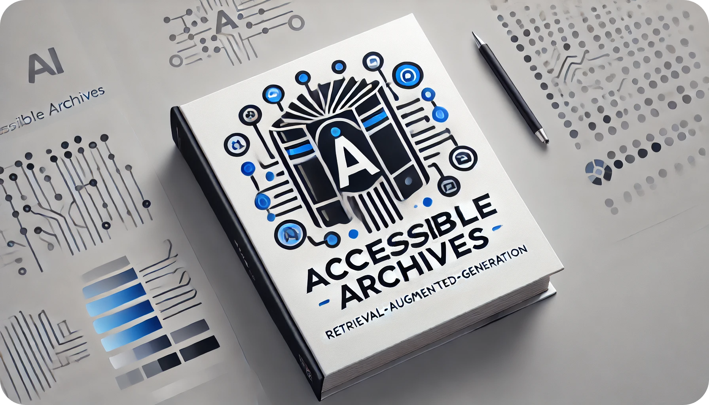

# Accessible Archives

_Explore thousands of documents with a friendly AI chat-assistant._

<p align="center">
  
</p>

## Overview

AccessibleArchives is a program that uses an AI chat-assistant to aid users in exploring the content of a large set of documents so you they don't have to read them all themselves.

To achieve the above goal, this project is includes the following components:
- OCR: transcribes text from images to support scanned physical documents, leveraging state-of-the-art **optical character recognition (OCR)** technology (ChatGPT!)
- Data Curation: organises source material, transcriptions, multi-page documents and categorising them
- decentralised storage: supports **IPFS** data storage for easy sharing
- LLM chat-assistant: uses **large language models (LLM)** to allow the user to ask about the documents' contents
- RAG: uses **retrieval augmented generation (RAG)** to allow 

These components are bundled into a web-application (OCR & data-curation are still missing in the GUI), and we are working on bundling it into a stand-alone executable.

## User-Interface

The AccessibleArchives GUI allows the user to browse through documents and ask a chatbot questions about them.


## Installation

### Prerequisites

- Python 3.10+
- Pip (Python package installer)

### Setup

```bash
git clone https://github.com/BeyondDimensions/AccessibleArchives.git
cd AccessibleArchives

# Install Dependencies
pip install -r requirements.txt
```

### Running the Application

```bash
streamlit run app.py
```

## Docker

A docker container can be used for development.
Distribution is not recommended due to these [security risks](https://github.com/emendir/Docker-Systemd-IPFS/tree/a473ae2bc614a056ddd437928599c573c5aaf1ea?tab=readme-ov-file#security-considerations).

1. [build docker image](docs/DevOps/BuildingDockerImage.md)
2. [create and use docker container](docs/DevOps/BuildingDockerImage.md)

## Technologies Used

- Python: primary programming language
- Streamlit: GUI framework
- 
- ChatGPT: for OCR (transcribing images)
- IPFS: for de

## Contribution

Contributions are welcome! Please fork the repository and create a pull request with your changes.

## License

This project is licensed under the MIT License. See the LICENSE file for more details.

## Contact

For any questions or suggestions, please open an issue in the repository or contact us.
